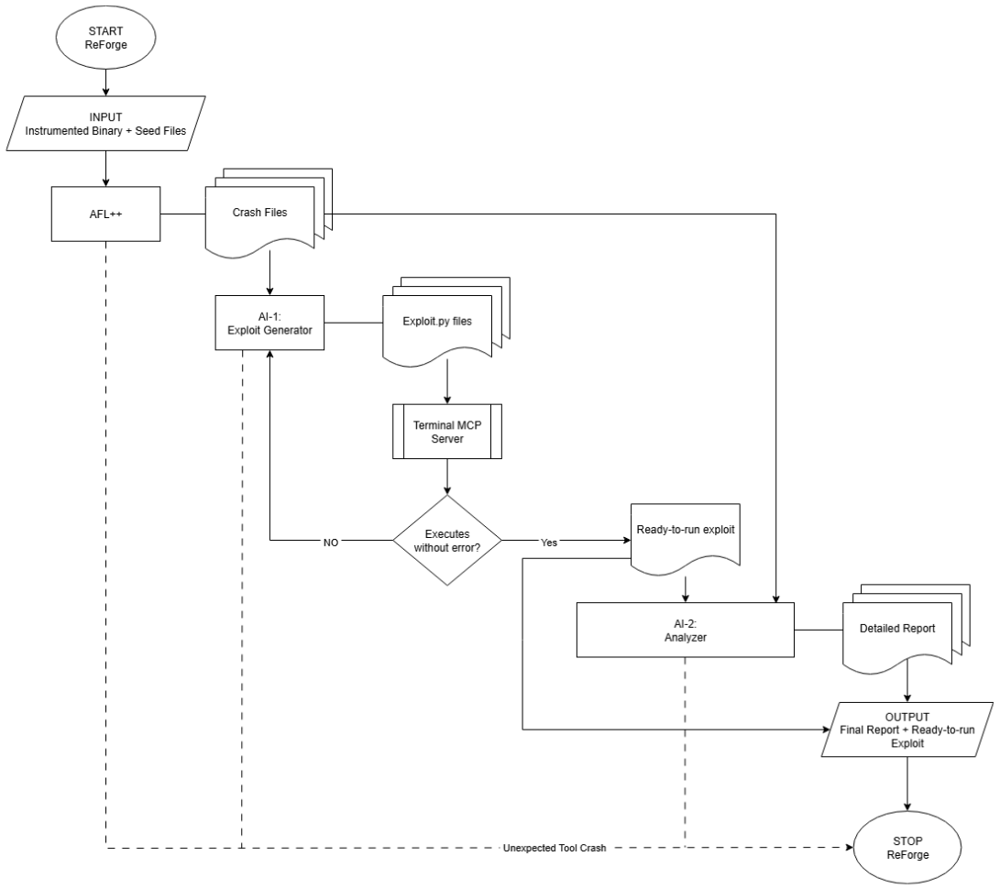

# ReForge

<p align="center">
  
  
  
  
</p>

## Overview

ReForge is an end-to-end research framework that fuses AFL++ fuzzing, cloud-grade LLM exploit generation, and a local analyst model under a single orchestrator.
At its core, ReForge pushes every crash- or hang-inducing input through an AI "forge":

**AI-1 · Exploit Generator** – turns raw crash data into a runnable Python PoC.

**MCP Orchestrator** – coordinates validation loops and state-sharing between the AIs.

**AI-2 · Analyzer** – produces a human-readable report that explains the exploit in plain English.

Because ReForge's pipeline is model-agnostic, you can swap the cloud model, the local model, or even the decision logic in MCP without touching the fuzzing harness. The result is a repeatable cycle that discovers, weaponises, and explains software weaknesses with minimal human intervention.

## Workflow

<p align="center">
  
</p>


1. **AFL++** finds interesting inputs (crashes, hangs, anomalous paths).

2. **MCP** streams each artefact—plus binary metadata—into **AI-1**.

3. **AI-1** returns a candidate exploit. MCP executes it against the un-instrumented binary.

4. If the exploit misfires, MCP feeds the error context back to **AI-1** until it passes or loop termination triggers, whichever comes first.

5. A validated exploit and its provenance are handed to **-2**, which writes a beginner-friendly analysis report.

6. Everything (exploit, explanation, report, validation log) lands in `/results`.


## Demo

[demo video]


### Key Features

1. **Fully Autonomous Pipeline**: - From fuzzing to exploit generation to human-readable reporting — all triggered via a single script, minimal manual intervention required.

2. **Exploit Generation via LLMs**  
    ReForge integrates directly with cloud-based LLMs to convert crash artefacts into working Python exploits. It does this intelligently, validating and refining output until execution succeeds.

3. **On-Device Vulnerability Analysis**  
    A local custom-model translates technical exploits into plain-English explanations, ideal for reporting, documentation, or onboarding junior analysts.

4. **Model Coordination Protocol (MCP)**  
    The modular design includes a lightweight orchestration layer that tracks state between models, handles decision logic, and supports pluggable backend upgrades.

5. **AFL++ Integration (In & Out of the Loop)**  
    ReForge leverages AFL++ for crash discovery, with instrumentation for fuzzing and clean binaries for validation — making your toolchain both surgical and repeatable.

6. **Robust Validation Loop**  
    Every AI-generated exploit is executed and tested against the original binary. If it fails, contextual output is looped back to the generator to improve the payload via *Model Context Protocol (MCP)*.

7. **Clean Output for Further Automation**  
    All artefacts — validated exploits, original crashes, logs, and AI reports — are saved in a predictable folder structure suitable for CI/CD pipelines or security audits.
   


## Prerequisites

### System Requirements
- **Operating System**: Linux (Ubuntu/Debian recommended)
- **Python**: 3.8+
- **Memory**: 8GB+ RAM recommended
- **Storage**: 8GB+ free space

### Required Tools
- AFL++ fuzzer
- GCC/Clang compiler toolchain
- Python development headers

*above required tools will be installed under docker deployment.*


## Docker Deployment

The easiest way to get started is using our pre-configured Docker container:

```bash

#Clone the repository
git clone https://github.com/danindu/reforge.git
cd reforge

# Build the Docker image
docker build -t reforge .

# Run the container interactively
docker run -it reforge

# Inside the container, set up your API keys (for PoC)
echo "AI_API_KEY=your_key_here" > .env

# Make the main script executable
chmod +x run_reforge.sh

# Run the complete automation pipeline
./run_reforge.sh
```

## Target Preparation

**For AFL++ fuzzing, you need TWO versions of your target binary:**

1. **Instrumented Binary**: Compiled with AFL++ instrumentation
```bash
# Example compilation
afl-clang-fast++ -o target_instrumented target.c
```

2. **Uninstrumented Binary**: Standard compilation for exploit testing
```bash
# Example compilation
gcc -o target_uninstrumented target.c
```

### Seed Corpus Setup
```bash
# Create seed directory
mkdir -p corpus/seeds

# Add sample input files
echo "sample input" > corpus/seeds/seed1.txt
echo "another sample" > corpus/seeds/seed2.txt
```


##  Project Structure

```
ReForge/
├── run_reforge.sh      
├── run_fuzzing.sh              
├── setup/
│   └── install_afl.sh          
├── api_handlers/
│   ├── ai1_handler.py        
│   └── ai2_handler.py  
├── utils/
│   ├── exploit_validator.py    
│   └── mcp_terminal.py          
├── models/
│   └── llama/                  
├── corpus/
│   └── seeds/                  
├── results/
│   ├── crashes/                
│   ├── exploits/               
│   └── reports/                
├── requirements.txt            
└── .env                        
```

## Output Analysis

| Artefact                   | Path                                    | What You Get                                                                                                    |
| -------------------------- | --------------------------------------- | --------------------------------------------------------------------------------------------------------------- |
| **Validated exploits**     | `results/exploits/`                     | Self-contned Python PoCs ready for red-team use or bug-bounty submission.                                     |
| **Raw inputs**             | `results/crashes/`  /  `results/hangs/` | Original AFL++ files that triggered abnormal behaviour—kept for triage or alt-analysis.                         |
| **Validator logs**         | `results/validation/`                   | Exact console output, return codes, and timing data for every exploit attempt—perfect for CI regression checks. |
| **Human-readable reports** | `results/reports/`                      | Markdown files from **-2** that cover vulnerability mechanism, exploit path, impact, and defensive guidance.  |
ReForge’s directory layout makes it trivial to feed artefacts into downstream pipelines—static analysis, SBOM attestation, or continuous red-team testing—without additional parsing.

## Contributing

Contributions are always welcome!

We welcome contributions from the community. Here's a detled guide on how to get involved:

### Fork the Repository

Click the Fork button on the GitHub repository to create your own copy.

### Create a Feature Branch

Create a new branch for your feature

```bash
git checkout -b feature/your-feature-name
```
### Commit Your Changes

```bash
git commit -m "Add detled feature description"
```

### Push the Branch

```bash
git request-pull mn origin/my-feature-branch
```

## Acknowledgments

We sincerely thank all open-source developers and contributors for their invaluable contributions.

## Authors
- Danindu Gammanpilage ([@Danindu](https://github.com/danindu))
- Sohan Simhar Prabakar ([@Sohan245](https://github.com/Sohan245/))
- Samarth Bhat
- Abhinav Harsha ([@Abinav28](https://github.com/Abinav28))
